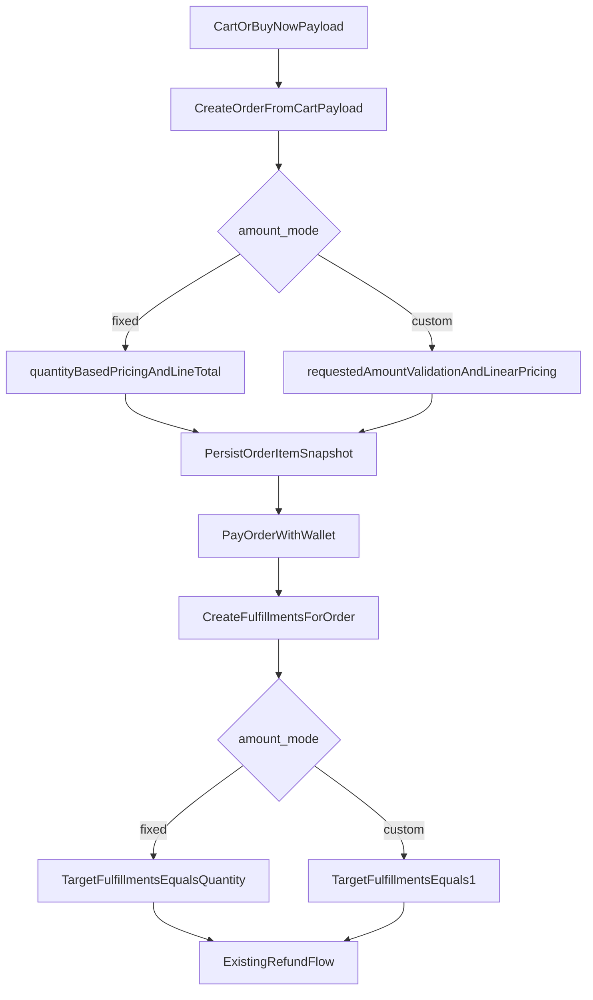

# Custom Amount Products Implementation Plan

## Scope and invariants

- Preserve current behavior for fixed products: `quantity` drives multiplicity, `line_total = unit_price * quantity`, refunds remain per-fulfillment unit logic.
- Add a new product mode for custom amount where `quantity` is forced to `1`, exactly one fulfillment is created, and fulfillment payload carries the requested amount.
- Use linear pricing (`price = amount × rate`) and design metadata so partial refunds can be added later without breaking contracts.

## 1) Database changes

### New fields

- **Products** (`products`)
  - `amount_mode` enum/string: `fixed` | `custom` (default `fixed`).
  - `amount_unit_label` nullable string (e.g. `UC`, `crystals`) for UI/ops.
  - `custom_amount_min` nullable unsigned integer.
  - `custom_amount_max` nullable unsigned integer.
  - `custom_amount_step` nullable unsigned integer (default `1` when custom).
  - `custom_price_rate` nullable decimal (per-unit rate for linear pricing).
- **Order items** (`order_items`)
  - `amount_mode` string/enum snapshot (`fixed`|`custom`).
  - `requested_amount` nullable unsigned bigint/integer snapshot (customer-entered amount).
  - `amount_unit_label` nullable string snapshot.
  - `pricing_meta` nullable json snapshot (rate used, rounding, source).
- **Fulfillments** (`fulfillments`) *(optional but recommended for operational clarity)*
  - Keep existing `meta` as primary source, optionally add `requested_amount` nullable unsigned bigint for easier querying/reporting.

### Migration strategy

- Add nullable/backfilled columns first; default product mode to `fixed`.
- Avoid changing or removing existing columns (`quantity`, `unit_price`, `line_total`) to maintain compatibility.
- Update model casts/fillables in:
  - `[c:\xampp\htdocs\laravel\karman.store\app\Models\Product.php](c:\xampp\htdocs\laravel\karman.store\app\Models\Product.php)`
  - `[c:\xampp\htdocs\laravel\karman.store\app\Models\OrderItem.php](c:\xampp\htdocs\laravel\karman.store\app\Models\OrderItem.php)`
  - `[c:\xampp\htdocs\laravel\karman.store\app\Models\Fulfillment.php](c:\xampp\htdocs\laravel\karman.store\app\Models\Fulfillment.php)`

## 2) Product modeling

### New logic

- Product has explicit mode:
  - `fixed`: current behavior.
  - `custom`: user must provide `requested_amount` within min/max/step.
- Product carries `custom_price_rate` and unit label for display + checkout validation.

### Existing unchanged logic

- Product identity, package requirements, active state, and existing pricing fields stay in place for fixed products.

## 3) Checkout flow

### Payload contract

- Extend item payload to support:
  - `quantity` (required for fixed; ignored/normalized for custom)
  - `requested_amount` (required for custom; ignored for fixed)
- Keep current keys (`product_id`, `package_id`, `requirements`) unchanged.

### Backend normalization and validation

- Update `[c:\xampp\htdocs\laravel\karman.store\app\Actions\Orders\CreateOrderFromCartPayload.php](c:\xampp\htdocs\laravel\karman.store\app\Actions\Orders\CreateOrderFromCartPayload.php)`:
  - Load product first, branch by `amount_mode`.
  - `fixed`: keep existing `quantity > 0` rules.
  - `custom`: validate `requested_amount` against product min/max/step, force normalized `quantity = 1`.
- Update cart hash in `[c:\xampp\htdocs\laravel\karman.store\app\Actions\Orders\CheckoutFromPayload.php](c:\xampp\htdocs\laravel\karman.store\app\Actions\Orders\CheckoutFromPayload.php)` to include `requested_amount` for idempotency correctness.

## 4) Pricing logic

### New logic

- Introduce amount-aware pricing call path (either extend existing service or add a thin wrapper action) so custom pricing still flows through `CustomerPriceService` and floor logic.
- For custom products:
  - Resolve per-unit effective price/rate via pricing service.
  - `line_total = round(resolved_rate * requested_amount, 2)`.
  - `unit_price` remains the refund-per-fulfillment amount in custom mode; with one fulfillment, set `unit_price = line_total` for compatibility.
- Persist pricing metadata (`rate`, `requested_amount`, floor flags) into `order_items.pricing_meta`.

### Existing unchanged logic

- Fixed products continue using current `priceFor($product, $user, overrides)` and `line_total = unit_price * quantity`.

## 5) Order item creation

### New logic

- Snapshot fields per item:
  - `amount_mode`
  - `requested_amount` (custom only)
  - `amount_unit_label`
  - `pricing_meta`
- Custom mode:
  - `quantity = 1`
  - `unit_price = line_total`

### Existing unchanged logic

- Fixed mode keeps current fields/values exactly as now.

## 6) Fulfillment logic

### New logic

- In `[c:\xampp\htdocs\laravel\karman.store\app\Actions\Fulfillments\CreateFulfillmentsForOrder.php](c:\xampp\htdocs\laravel\karman.store\app\Actions\Fulfillments\CreateFulfillmentsForOrder.php)`:
  - Determine target fulfillment count by mode:
    - `fixed`: target = `quantity`
    - `custom`: target = `1`
  - Keep idempotent delta logic (`target - existing_count`).
  - Add `requested_amount` + unit label into fulfillment `meta` on creation for delivery pipeline visibility.
- Ensure process command/action can pass requested amount in delivered payload path if provider integration needs it.

### Existing unchanged logic

- Status lifecycle, logs, and events remain unchanged.

## 7) Refund logic

### New logic

- Full refund only now, future partial-ready metadata:
  - Custom mode still has one fulfillment; refund amount remains `order_item.unit_price` (which equals full custom line total).
  - Add metadata to refund transaction for future partial capability (`requested_amount`, `refundable_amount_total`, `refunded_amount_accumulated=full`).
- No partial computation implementation now.

### Existing unchanged logic

- Fixed products keep per-fulfillment refund behavior exactly as today in:
  - `[c:\xampp\htdocs\laravel\karman.store\app\Actions\Orders\RefundOrderItem.php](c:\xampp\htdocs\laravel\karman.store\app\Actions\Orders\RefundOrderItem.php)`
  - `[c:\xampp\htdocs\laravel\karman.store\app\Actions\Refunds\ApproveRefundRequest.php](c:\xampp\htdocs\laravel\karman.store\app\Actions\Refunds\ApproveRefundRequest.php)`

## 8) Frontend changes

### Cart model (`resources/js/app.js`)

- Add optional `requested_amount`, `amount_mode`, min/max/step, unit label in cart item shape.
- Fixed products keep quantity increment/decrement behavior.
- Custom products:
  - quantity locked to `1` in UI/store.
  - input controls update `requested_amount` instead.

### Cart page and buy-now UI

- Update:
  - `[c:\xampp\htdocs\laravel\karman.store\resources\views\pages\frontend\⚡cart.blade.php](c:\xampp\htdocs\laravel\karman.store\resources\views\pages\frontend\⚡cart.blade.php)`
  - `[c:\xampp\htdocs\laravel\karman.store\resources\views\components\main\⚡buy-now-modal.blade.php](c:\xampp\htdocs\laravel\karman.store\resources\views\components\main\⚡buy-now-modal.blade.php)`
- Render amount input only for custom products; show min/max/step hints and unit label.
- Keep existing requirement validation flow; add amount validation messages and mapping.

## 9) Backward compatibility guarantees

- Do not alter semantics for existing records with `amount_mode` null/`fixed`.
- Default migration values ensure all existing products remain fixed.
- Preserve existing API/input keys; add optional fields.
- Preserve fulfillment queue lifecycle and admin pages; only add extra metadata display where helpful.

## 10) Testing plan (Pest, minimal targeted)

- Update/add tests in:
  - `[c:\xampp\htdocs\laravel\karman.store\tests\Feature\CheckoutFlowTest.php](c:\xampp\htdocs\laravel\karman.store\tests\Feature\CheckoutFlowTest.php)`
  - `[c:\xampp\htdocs\laravel\karman.store\tests\Feature\FulfillmentActionsTest.php](c:\xampp\htdocs\laravel\karman.store\tests\Feature\FulfillmentActionsTest.php)`
  - refund feature tests covering both modes.
- Required scenarios:
  - Fixed product unchanged: quantity N creates N fulfillments.
  - Custom product checkout: quantity normalized to 1, requested_amount required, one fulfillment created.
  - Custom fulfillment meta carries requested amount.
  - Custom refund full amount works and order status transitions remain valid.
  - Idempotency/cart hash differs when requested_amount differs.

## 11) Rollout sequence

1. Ship migrations + model casts (safe, no behavior change yet).
2. Add backend branching in checkout/pricing/order-item creation.
3. Add fulfillment branching and meta propagation.
4. Add frontend custom amount UI/payload.
5. Add/adjust tests and run focused suites.
6. Optional admin/reporting surface for requested amount fields.

